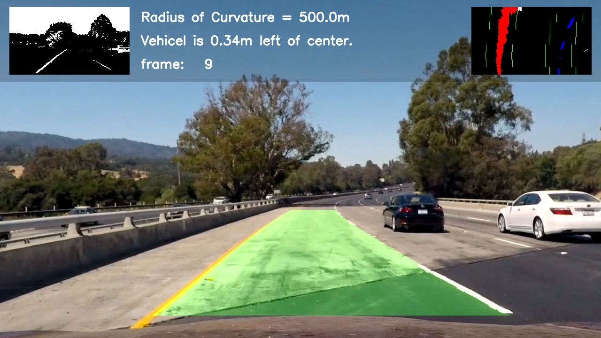

## Advanced Lane Finding
[](http://www.udacity.com/drive)

The Project
---

The goals / steps of this project are the following:

* Compute the camera calibration matrix and distortion coefficients given a set of chessboard images.
* Apply a distortion correction to raw images.
* Use color transforms, gradients, etc., to create a thresholded binary image.
* Apply a perspective transform to rectify binary image ("birds-eye view").
* Detect lane pixels and fit to find the lane boundary.
* Determine the curvature of the lane and vehicle position with respect to center.
* Warp the detected lane boundaries back onto the original image.
* Output visual display of the lane boundaries and numerical estimation of lane curvature and vehicle position.

The Project Files
---
- The images for camera calibration are stored in the folder called `camera_cal`.  
- The images in `test_images` are for testing your pipeline on single frames.  
- `output_images` directory with the examples of the output
- `calibrate_camera.py`     Camera calibration code
- `camera_calib_result.npz` Serialized camera calibration and distortion matrices
- `main.py`     Main program file to run.  It processes video and call on pipeline.py to draw the lanes.
- `pipeline.py` The class that does it!  It uses the support methods in utils.py and Line class in line.py
- `line.py`     Line class storing the lane line coefficients
- `utils.py`    Some support functions for the pipeline
- `test_pipeline.py`    Method used to test the pipeline against part of a video.  The vid directory containing all
    the video frame images is not provided.
- `project_video_out.mp4`   The video output with the lanes drawn

Camera Calibration
---

The camera calibration code is in `calibrate_camera.py`.

I start by preparing "object points", which will be the (x, y, z) coordinates of the chessboard corners in the world. 
Here I am assuming the chessboard is fixed on the (x, y) plane at z=0, such that the object points are the same for 
each calibration image.  Thus, `objp` is just a replicated array of coordinates, and `objpoints` will be appended 
with a copy of it every time I successfully detect all chessboard corners in a test image.  `imgpoints` will be 
appended with the (x, y) pixel position of each of the corners in the image plane with each successful chessboard 
detection.  

I then used the output `objpoints` and `imgpoints` to compute the camera calibration and distortion coefficients 
using the `cv2.calibrateCamera()` function.  The coefficients are stored in `camera_calib_result.npz`. I applied this 
distortion correction to the test image using the `cv2.undistort()` function and obtained this result: 


Pipeline (single images)
---

The pipeline code is contained in the Pipeline class, file `pipeline.py`.  The main method here is `draw_lane`.

#### 1. Distortion Correction

I loaded (`__init__` constructor) and applied (line 39) the camera calibration matrices to each frame.  
Here is a sample distortion output:

![alt text][image2]

#### 2. Gradient and Color Filters

I used a combination of color and gradient thresholds to generate a binary image (lines 117 through 131 in method 
`_apply_filters` file `pipeline.py`).  An example of the output is provided in each frame of the video in the meta 
layer (top left).

I adopted the filters from the Q&A session online.  Basically, I used Sobel gradient filters in x and y directions or
color space filters: S channel in HLS space and V channel in HSV space.



#### 3. Perspective Transform 

The code for my perspective transform includes a function called `unwarp_image()`, which appears in lines 133 through 
157 in the file `pipeline.py`.  The `unwarp_image()` function takes as inputs an image (`filtered_img`), as well as 
source (`src`) and destination (`dst`) points.  I chose to hardcode the source and destination points in the same way
as in Q&A video online.

```python
        self.bot_width = .76  # percent of bottom trapezoid height
        self.mid_width = .08  # percent of middle trapezoid height
        self.hight_pct = .62  # percent for trapezoid height
        self.bott_trim = .935  # percent from top to bottom to avoid the car hood

        ...
        
        src = np.float32([[img.shape[1] * (.5 - self.mid_width / 2), img.shape[0] * self.hight_pct],
                          [img.shape[1] * (.5 + self.mid_width / 2), img.shape[0] * self.hight_pct],
                          [img.shape[1] * (.5 + self.bot_width / 2), img.shape[0] * self.bott_trim],
                          [img.shape[1] * (.5 - self.bot_width / 2), img.shape[0] * self.bott_trim]])

        left_off_pct = 1 / 8  # part of left cut
        right_off_pct = 1 / 4  # part of right cut

        dst = np.float32([[img.shape[1] * left_off_pct, 0], [img.shape[1] * (1 - right_off_pct), 0],
                          [img.shape[1] * (1 - right_off_pct), img.shape[0]],
                          [img.shape[1] * left_off_pct, img.shape[0]]])
```

This resulted in the following source and destination points:

| Source        | Destination   | 
|:-------------:|:-------------:| 
| 589, 446      | 160, 0        | 
| 691, 446      | 960, 0        |
| 1126, 673     | 960, 720      |
| 160, 673      | 160, 720      |

I verified that my perspective transform was working as expected by drawing the `src` and `dst` points onto a test 
image and its warped counterpart to verify that the lines appear parallel in the warped image.

The warped image is output in each video frame in the top meta image layer (on the right).

#### 4. Lane-line Pixel Identification and Polynomial Interpolation (fitting)

I adopted sliding window code from the lecture to discover the line pixels and fit a quadratic polynomial through them.  
The code is the `self._sliding_win()` method in `pipeline.py`.  The method returns left and right Line container class 
objects and a bird-eye view image to be displayed in the meta image layer.  The Line class contains the image 
coefficients and `getPoints()` method outputting the line points along x axis given the input y axis points.
In the image, the left line pixels are colored red and the right line pixels are blue (see meta image layer in each 
video frame).

#### 5. Lane Curve Radius and Center Position Approximation

I approximated the lane curvature as was suggested in the lecture.  I converted the lane line coefficients from the 
pixel into the metric space.  Then, I applied the line curvature formulae.  The final curve radius is an average of left
and right line curve radii.  The code is in `evaluate_curve_radius()` method of class Line in `line.py` and in 
`pipeline.py` lines 75-78.

I calculated the car's off-center position by taking a difference between the image center (assumed camera position)
and the center of the detected lane (mean of left and right line positions).  The code can be found in 
`_calculate_dist_off_center()` method in `pipeline.py`.

#### 6. Final Lane Image

I implemented this step in lines 57 through 72 of `draw_lane()` and in `_fill_polygon_on_palette()` methods in 
`pipeline.py`.  

Here is an example of my result on a test image:


---

### Pipeline (video)

#### 1. Final Video Output.  

Here's the video included in this project [Final Video](./project_video_out.mp4)

---

### Discussion

The pipeline is heavily relying on the static warping ratios to transform the lane lines into a bird-eye view image 
space.  This is not a very robust approach as the road curvature may be very different between a highway and a local
serpantine road.  I believe, those ratios need to be adjusted based on the road type.

I did not implement the optimized targeted lane search here due to the time constraints.  So, the pipeline is not very
scalable to the real world.

I did try the pipeline on the first challenge video.  It looked like the gradient and color filtering was not very
robust.  The binary frame images had a lot of noise preventing a good line identification.  I abandoned this part due 
to the time constraints again.

